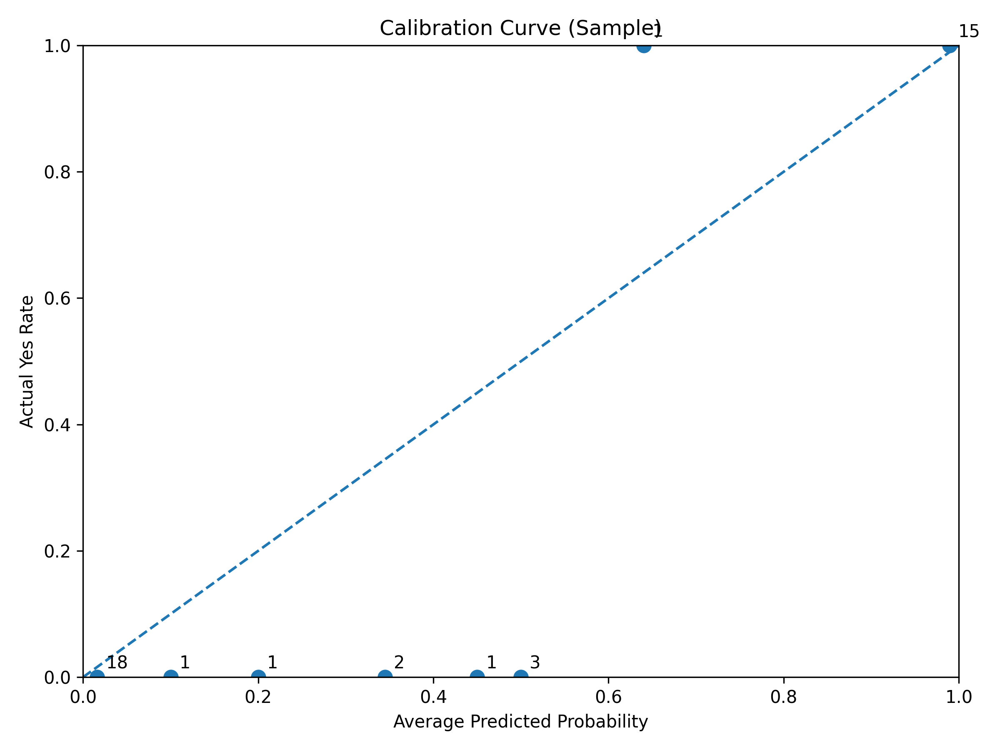
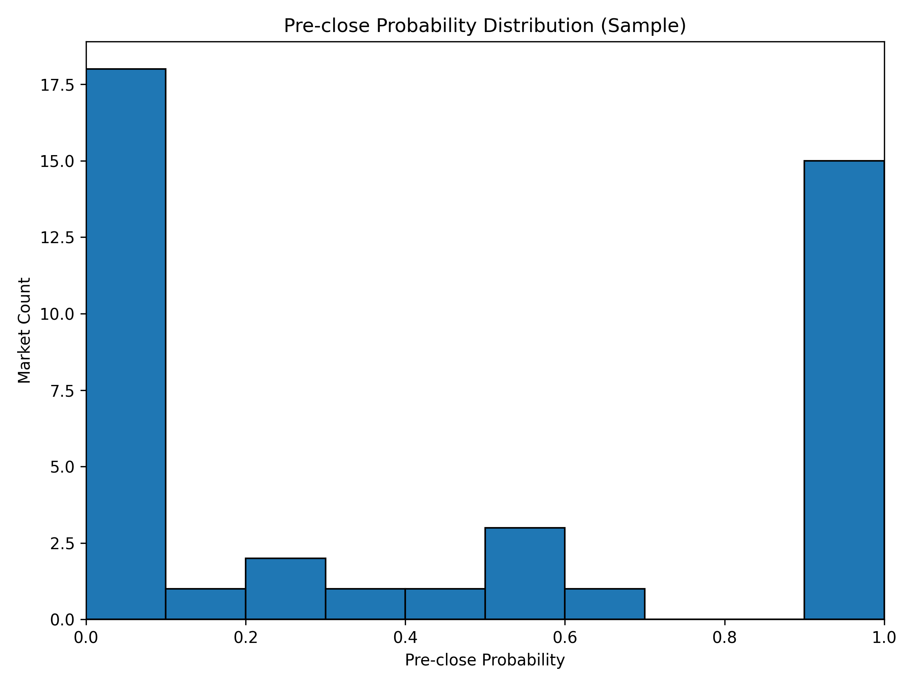

# Prediction Market Calibration

> Pilot study of 42 resolved Kalshi binary markets. Near close, implied probabilities were directionally informative at the extremes, but mid-range bins appeared less well calibrated.

## What This Repo Does

- Downloads public historical market data from Kalshi.
- Extracts final pre-close probabilities from historical candlestick data.
- Evaluates calibration with probability bins, Brier score, and visualizations.

## Overview

Prediction markets generate prices that can be interpreted as probabilities. This project studies whether those implied probabilities are actually well calibrated: when a market implies a high probability, does the event happen at a similarly high rate, and when it implies a low probability, does it usually fail to happen?

I built this project as a small research pipeline using public Kalshi historical data. The project began with market metadata, but after diagnosing the raw price fields, I found that metadata prices were not reliable enough for direct calibration analysis. I then switched to historical candlestick data and extracted a final pre-close probability for each market before resolution.

The current version is a pilot study on a filtered sample of resolved binary markets with usable candlestick histories.

## Research Question

Are prediction-market-implied probabilities well calibrated, especially near market close?

## Why This Matters

If prediction market prices are well calibrated, they can be useful not only for trading and forecasting, but also as a source of probabilistic information for decision-making and research. If they are poorly calibrated, especially in certain probability ranges or market categories, that opens up interesting questions about market structure, liquidity, and information aggregation.

## Methods

1. Collected historical market metadata from Kalshi public historical endpoints.
2. Filtered to resolved binary markets.
3. Diagnosed metadata price columns and found that they were not suitable for direct calibration analysis.
4. Switched to historical candlestick data.
5. Selected a pilot sample of active markets with valid open and close times.
6. Extracted the final available pre-close probability from candlestick price data.
7. Evaluated calibration using probability bins, actual outcome frequency, Brier score, and visualizations.

## Preliminary Findings

Using a pilot sample of 42 resolved binary markets with usable candlestick histories, I extracted a pre-close probability for each market from the final available historical candlestick before market close.

### Key Observations

- The pilot-sample Brier score is **0.032955**.
- Very low-probability markets, roughly in the `0.0` to `0.1` range, had an actual Yes rate close to **0** in this sample.
- Very high-probability markets, roughly in the `0.9` to `1.0` range, had an actual Yes rate close to **1** in this sample.
- Mid-probability bins in this sample appeared less well calibrated and tended to **overestimate Yes outcomes**.

### Interpretation

These early results suggest that market-implied probabilities in this filtered sample may be directionally informative, especially at the extremes, but calibration in the middle range is less reliable.

These findings are best interpreted as a proof-of-concept rather than a definitive statement about overall market calibration.

### Methodology Caveat

The current pilot uses the final available candle before close, which may not correspond to the exact same time-to-resolution across markets.

### Limitations

- The current pilot sample is small at **42 markets**.
- The sample is filtered to markets with usable candlestick histories, so it is not a random sample of all markets.
- Some market types and low-information markets were excluded.
- These findings should be treated as preliminary rather than definitive.

## Visuals

### Calibration Scatter Plot



### Pre-close Probability Histogram



## How To Run

```bash
python3 -m venv .venv
source .venv/bin/activate
pip install -r requirements.txt
python src/fetch_markets.py
python src/clean_market_metadata.py
python src/filter_binary_markets.py
python src/select_candlestick_sample.py
python src/fetch_candlesticks_sample.py
python src/extract_preclose_probabilities.py
python src/compute_calibration_metrics.py
python src/plot_calibration_curve.py
python src/plot_preclose_probability_histogram.py
```

## Project Structure

- `src/`: code for data collection and analysis
- `data/raw/`: raw downloaded data
- `data/processed/`: cleaned datasets
- `results/`: charts and outputs

## Tech Stack

- Python
- requests
- pandas
- matplotlib

## Future Work

- Expand beyond the current pilot sample of 42 markets.
- Compare calibration across market categories.
- Test probabilities at multiple time horizons before close instead of using only the final pre-close candle.
